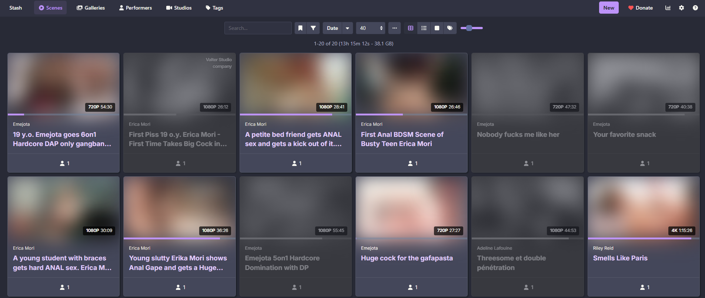

# stash-unorganized-highlight
An unorganized scenes highlighter for https://github.com/stashapp/stash  
See what scene needs organization at a glance!

## Preview

## Installation

* Download latest [Plugin version](https://codeload.github.com/morgan-holmes/stash-unorganized-highlight/zip/refs/heads/main).
* Unzip it into your Stash plugins directory (usually `.stash/plugins`). If `plugins` directory does not exist, create it beforehand.
* Go to Stash's `Settings` page, then `Plugins` category and click on the `Reload plugins` button.
* Plugin should appear into the installed plugins list.

## Parameters
* **Fade unorganized scenes cards**: Unorganized scenes are lightly faded.
* **Remove colors from unorganized scenes cards**: Display unorganized scenes in black and white tones.
* **Remove organized icon from organized scenes cards**: Remove the organized icon for organized scenes cards, since it's not so useful anymore.

